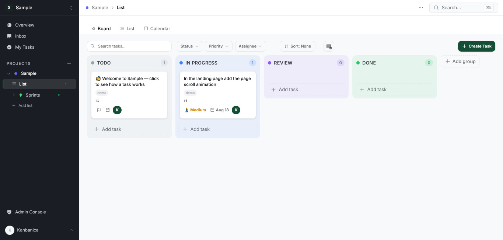
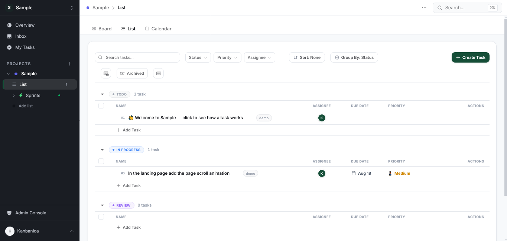
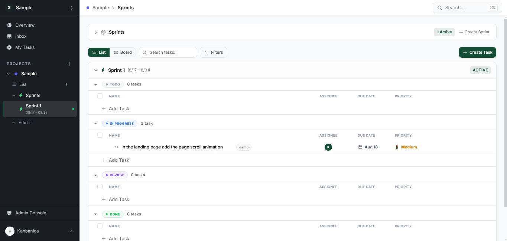
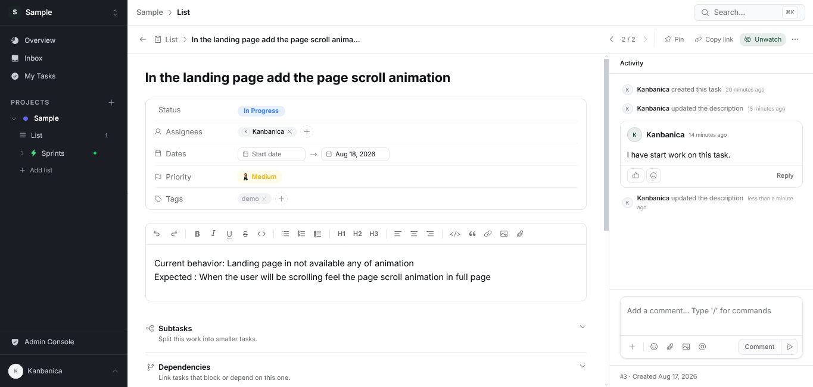
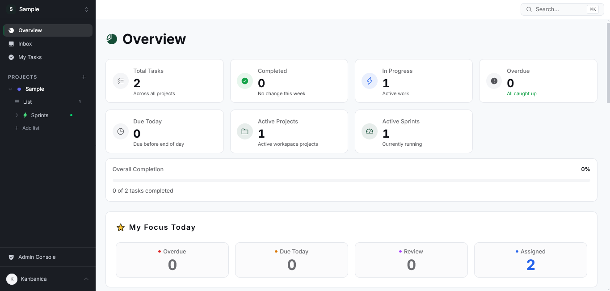
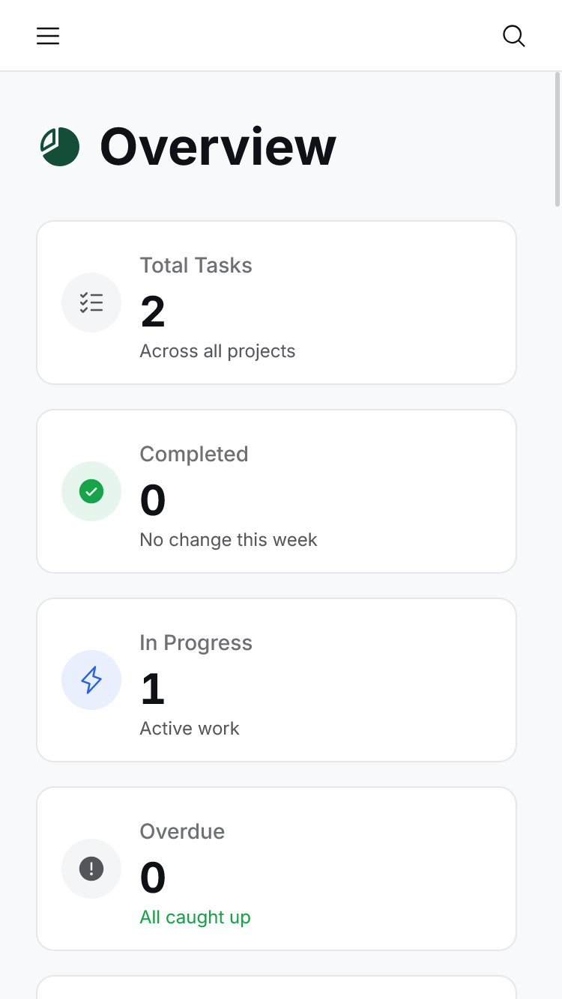

<div align="center">

# Kanbanica

**Project management for teams — Workspaces, Projects, Sprints, and Tasks, self-hosted on your own infrastructure.**

[](https://github.com/stack256org/kanbanica/actions/workflows/ci.yml)
[](https://github.com/stack256org/kanbanica/actions/workflows/release.yml)
[](./LICENSE)
[](./CONTRIBUTING.md)
[](https://nextjs.org/)
[](https://www.typescriptlang.org/)
[](https://www.postgresql.org/)

[Quick Start](#quick-start) · [Self-Hosting](#self-hosting) · [Documentation](#documentation) · [Contributing](#contributing)

</div>

---

## Overview

Kanbanica is a self-hostable, ClickUp-style project management app. Teams organize work in **Workspaces → Projects → Lists / Sprints → Tasks**, track it on Board, List, or Calendar, and collaborate in real time — comments, mentions, notifications, and live sync, all inside the task.

It's built for teams who want a complete, production-grade project tool without handing their data to a SaaS vendor: clone it, run it, extend it, and deploy it on infrastructure you control. MIT-licensed, no telemetry, no billing walls.

## Screenshots

**Board view.** Drag tasks between statuses, filter by priority or assignee, and see everything in a project at a glance.



**List view.** The same tasks, grouped by status, with a sortable table for bulk triage.



<table>
<tr>
<td width="50%" valign="top">

**Sprints.** Plan work into time-boxed sprints, tracked by status per sprint.



</td>
<td width="50%" valign="top">

**Task detail.** Description, assignees, dates, priority, tags, and a full comment/activity feed.



</td>
</tr>
</table>

<table>
<tr>
<td width="50%" valign="top">

**Workspace overview.** Cross-project stats and what's due today, at a glance.



</td>
<td width="50%" valign="top">

**Mobile.** Fully responsive down to a phone-sized viewport.



</td>
</tr>
</table>

<sub>Shown in dark mode — Kanbanica also ships a light theme, switchable per user.</sub>

## Contents

- [Key Features](#key-features)
- [Tech Stack](#tech-stack)
- [Quick Start](#quick-start)
- [Self-Hosting](#self-hosting)
- [Deploying Somewhere Else](#deploying-somewhere-else)
- [Configuration](#configuration)
- [Health Checks](#health-checks)
- [Backups](#backups)
- [Roles](#roles)
- [Documentation](#documentation)
- [Contributing](#contributing)
- [License](#license)

## Key Features

**For your team**

- **Workspaces → Projects → Lists / Sprints → Tasks** — a flexible hierarchy for organizing any team's work, viewed as Board, List, or Calendar
- **Rich tasks** — assignees, due dates, priorities, subtasks/checklists, file attachments, and Tiptap-powered descriptions with a `/` command menu
- **Custom Fields** — Text, Number, Checkbox, Single/Multi Select, Date, and Person, scoped to a Workspace, Project, or List
- **Time tracking** — a live timer or manual log per task, with per-user history
- **Sprints** — sprint planning, story points, and automatic sprint close
- **My Tasks** — one cross-workspace view of everything assigned to you
- **Collaboration** — threaded comments, @mentions, emoji reactions, and a full activity feed on every task
- **Real-time sync** — live updates over Server-Sent Events as teammates make changes, no refresh needed
- **Keyboard shortcuts** for navigation and common actions (press `?` for the reference)

**For whoever runs it**

- **Two-level permissions** — workspace roles plus per-project access, with guests scoped to only the projects they're invited to
- **Flexible auth** — magic link, Google OAuth, or email + password, all converging on one account per email
- **Notifications** — in-app, email digests, and Web Push
- **Help Center & Support Tickets** — a self-serve article library plus a ticket-based support channel for your users
- **Admin panel** — user management, integration settings, and platform-wide visibility
- **Integrations from the UI** — configure SMTP, Google OAuth, S3/R2 storage, and Web Push from Settings → Integrations, no `.env` editing or restart required (Google OAuth is the one exception)
- **Your files, your storage** — local disk in dev, S3 or Cloudflare R2 in production, one setting
- **Docker self-hosting** — one command brings up Postgres, the app, and the background worker

## Tech Stack

| Layer | Choice |
|-------|--------|
| Framework | Next.js 16 (App Router) |
| Language | TypeScript |
| Database | PostgreSQL + Drizzle ORM |
| Auth | Better Auth (magic link / Google OAuth / password) |
| Styling | Tailwind CSS v4 + DaisyUI |
| Rich Text | Tiptap |
| State | SWR (server) + React state/context (client) |
| Real-time | Server-Sent Events (SSE) |
| Background Jobs | pg-boss worker |
| Email | Nodemailer (SMTP) |
| File Storage | files-sdk (local FS in dev → S3/R2 in prod) |

## Quick Start

Requires **Node.js 22** and **pnpm**. No separate database install needed — a local Postgres is bundled for development.

```bash
git clone https://github.com/stack256org/kanbanica.git kanbanica
cd kanbanica
pnpm install
cp .env.example .env
pnpm db:local     # start the bundled dev database (leave running)
pnpm db:migrate   # create the tables (first time only)
pnpm dev          # start the web app + worker
```

Open <http://localhost:3000>. On a fresh database you land on the **first-run setup wizard** at `/setup` — enter a name, email, and password to create your administrator account and you're signed straight in. No separate terminal step needed.

> Prefer another way in? Sign in with a **magic link** (printed to your terminal when no SMTP is configured), or set `ALLOW_PASSWORD_SIGNUP=true` and register at `/signup`. To promote an existing account to admin, run `pnpm make:admin you@example.com`.

📖 Full walkthrough with troubleshooting: **[SETUP.md](./SETUP.md)**.

## Self-Hosting

Deploy Kanbanica for your team with Docker Compose — Postgres, the app, and the worker, one command:

```bash
cp .env.example .env   # set DATABASE_URL, APP_SECRET, APP_URL — everything else is optional
docker compose up -d --build
```

**Already have a PostgreSQL?** Point `DATABASE_URL` at it and add the overlay — the bundled database container is never started, and migrations still run automatically before the app boots.

```bash
docker compose -f docker-compose.yml -f docker-compose.external-db.yml up -d
```

Any PostgreSQL 16+ reachable over the network works — company cluster, RDS, Neon, Supabase, Railway, Render, DigitalOcean — there's no provider-specific code. Magic-link email works with any SMTP provider (Resend, Brevo, Postmark, SES, …), configurable via env vars or Settings → Integrations after your first boot.

Full production guide, HTTPS/reverse proxy setup, and backup/restore: **[DEPLOYMENT.md](./DEPLOYMENT.md)**. Step-by-step credential guides (Google OAuth, SMTP, Web Push, S3, Cloudflare R2): **[`docs/credentials/`](./docs/credentials/)**.

## Deploying Somewhere Else

Kanbanica ships one Dockerfile for the app (`Dockerfile`) and one for the worker (`Dockerfile.worker`) — any platform that runs a container can run it, not just Docker Compose.

**Coolify, Dokploy, CapRover, Portainer, Kubernetes, Docker Swarm, ECS.** Run three services from the same two images:

| Service | Built from | Command | Notes |
|---------|-----------|---------|-------|
| app | `Dockerfile` | *(default image `CMD`)* | Serves on port 3000. Probe `GET /api/health`. |
| worker | `Dockerfile.worker` | `pnpm worker:start` | No web port — background jobs and outgoing email don't run without it. |
| migrate | `Dockerfile.worker` | `pnpm db:migrate:prod` | Run once to completion before `app`/`worker` start on each deploy. |

On the default `STORAGE_DRIVER=local`, mount a persistent volume at `/app/uploads` — S3/R2 need none. If your platform generates its own Compose file rather than using `docker-compose.yml` directly, double-check it keeps volume names stable across redeploys — some tools (observed with Dokploy) don't, which silently creates a new empty volume and orphans the old one instead of erroring. See [DEPLOYMENT.md](./DEPLOYMENT.md) for the full reasoning and compose-file examples.

Point your platform at the published image directly rather than building from source:

<!-- BEGIN GENERATED: image-tag -->
Pin a version in production, because `latest` moves with every release:

```bash
docker pull ghcr.io/stack256org/kanbanica:0.1.0
```

Also tagged `0`, `0.1`, and `latest` — every tag covers both Intel and ARM.
<!-- END GENERATED: image-tag -->

**Railway, Render, Fly.io, or anything else building from source.**

1. Fork this repository.
2. Create a project pointing at your fork, with a PostgreSQL add-on.
3. Set the required env vars — see [Configuration](#configuration) below.
4. Deploy. Same caveat as above: you need the **worker** as a second, separate service, not just the web process.

## Configuration

### Required

| Variable | What it is |
|----------|------------|
| `DATABASE_URL` | PostgreSQL 16+ connection string |
| `APP_SECRET` | Session/crypto secret — 32+ random characters. Generate with `openssl rand -hex 32` |
| `APP_URL` | Public base URL of this instance (auth links, invites, file URLs). No trailing slash |

### Optional

Everything else — SMTP, Google OAuth, S3/R2 storage, Web Push — can be configured **from inside the app** instead of `.env`: the `/setup` wizard's "Configure services" step, or any time after from **Settings → Integrations**. A value saved in the app always takes priority over its matching `.env` variable, so existing `.env`-only deployments keep working unchanged.

| Integration | What it enables | Setup guide |
|---|---|---|
| SMTP | Magic-link email, notifications | [docs/credentials/smtp.md](./docs/credentials/smtp.md) |
| Google OAuth | "Continue with Google" sign-in | [docs/credentials/google-oauth.md](./docs/credentials/google-oauth.md) |
| S3 / Cloudflare R2 | Object storage for uploads | [docs/credentials/storage-s3.md](./docs/credentials/storage-s3.md) / [docs/credentials/cloudflare-r2.md](./docs/credentials/cloudflare-r2.md) |
| Web Push | Browser push notifications | [docs/credentials/web-push-vapid.md](./docs/credentials/web-push-vapid.md) |

SMTP, storage, and Web Push changes apply immediately. Google OAuth is read once at process start, so a saved change needs an app restart to take effect. Secrets are encrypted at rest and never sent back to the browser after saving.

Full reference: **[docs/integrations.md](./docs/integrations.md)**.

## Health Checks

`GET /api/health` needs no authentication and reports whether the app can reach its database — it's what the Docker image uses as its own healthcheck, and it's safe to point a load balancer or uptime monitor at directly.

```bash
curl http://localhost:3000/api/health
# {"ok":true,"db":"connected","version":"0.1.0"}
```

Returns `503` with `"db":"disconnected"` when the database is unreachable. `version` reflects the running build — `"dev"` for a local build, or the release version on a published image.

## Backups

Backups are not automatic — set them up yourself. Always back up the **Postgres database**; also back up the **`uploads` volume** if you're on `STORAGE_DRIVER=local` (not needed on S3/R2). Commands, a scheduled cron example, and full restore steps: [DEPLOYMENT.md § Backups & Restore](./DEPLOYMENT.md#7-backups--restore).

## Roles

| Role | Scope |
|------|-------|
| **Owner** | Full control over the workspace — exactly one per workspace |
| **Admin** | Manages members and Spaces, all workspace settings — cannot delete the workspace |
| **Member** | Works inside Spaces they've been given access to |
| **Guest** | External collaborator, scoped to only the Spaces they're explicitly invited to |

Each Space also carries its own permission level, independent of Workspace Role, governing everything inside it — Lists, Tasks, Subtasks. Full matrix: [docs/permission-model.md](./docs/permission-model.md).

## Documentation

| Topic | Document |
|-------|----------|
| Local development | [SETUP.md](./SETUP.md) |
| Self-hosting with Docker | [DEPLOYMENT.md](./DEPLOYMENT.md) |
| Cutting a release | [docs/releasing.md](./docs/releasing.md) |
| How the system fits together | [ARCHITECTURE.md](./ARCHITECTURE.md) |
| Conventions & key decisions | [CLAUDE.md](./CLAUDE.md) |
| SMTP / OAuth / storage / push config | [docs/integrations.md](./docs/integrations.md) |
| Credential setup (Google, SMTP, S3, R2, Web Push) | [`docs/credentials/`](./docs/credentials/) |
| Authentication | [docs/authentication.md](./docs/authentication.md) |
| Permissions model | [docs/permission-model.md](./docs/permission-model.md) |
| Real-time sync | [docs/realtime.md](./docs/realtime.md) |
| Database schema | [docs/database-schema.md](./docs/database-schema.md) |
| All feature specs (tasks, sprints, notifications, search, and more) | [`docs/`](./docs) |
| Planned features & direction | [ROADMAP.md](./ROADMAP.md) |
| Release history | [CHANGELOG.md](./CHANGELOG.md) |

## Contributing

Contributions are welcome! **[CONTRIBUTING.md](./CONTRIBUTING.md)** covers project layout, coding conventions, and the pull-request process. Everyone taking part is expected to follow the [Code of Conduct](./CODE_OF_CONDUCT.md).

Found a security problem? Please don't open a public issue — see **[SECURITY.md](./SECURITY.md)**.

## License

Kanbanica is open source under the [MIT License](./LICENSE).
